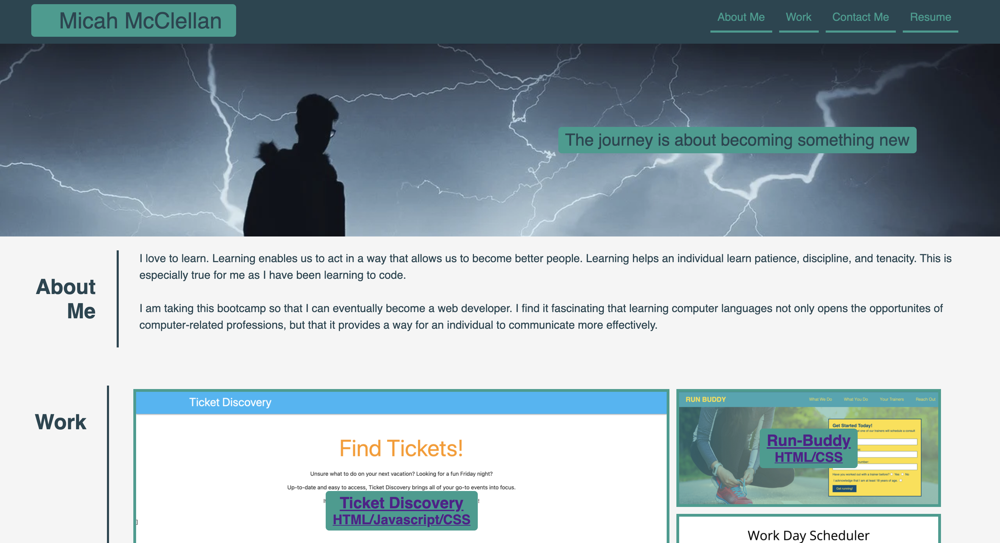

# Professional Portfolio

## Micah-Portfolio

This project is a combination of HTML/CSS to create a portfolio. Each section has a link to it in the navigation bar. Only two of the applications in the work-grid section are deployable: Run-Buddy and Horiseon. I do not have any other applications to showcase yet. The contact links at the bottom are each active.

I put a lot of work into getting this website to where it is. I hope that as I continue to learn and get feedback, that I will be able to vastly improve the content and styling of this portfolio.

## Link to the deployed application:

[My Portfolio](https://mcclellan-micah.github.io/micah-portfolio/)

## Screenshot of deployed applicaiton:

